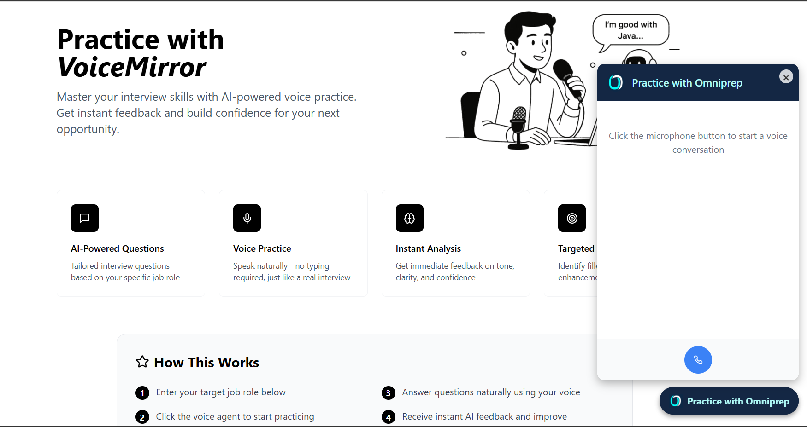
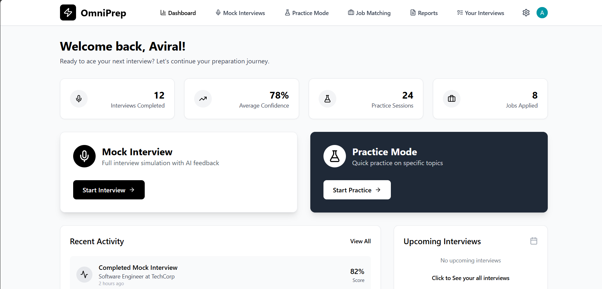

# 🎤💼 OmniPrep – Your AI Voice Coach for Interviews

> *"Built for the millions of job seekers who never had access to mock interviews, personal coaching, or English fluency — until now."*

**OmniPrep** is an AI-powered, voice-first interview preparation platform that simulates real-life interviews, analyzes speech for filler words and hesitation, and provides actionable, spoken feedback — built especially for **Tier-2/3 students and underrepresented job seekers**.

<br>




---

## 🌟 Why OmniPrep?

> ⚠️ Not your typical interview prep tool — OmniPrep gives you **live, AI-powered, voice-based mock interviews** with real-time spoken feedback to actually improve how you sound, not just what you say.

Traditional interview prep platforms are text-heavy, generic, and expensive. OmniPrep flips the model:

- 🎙 **Voice-Based Practice** — Speak naturally with two trained AI agents, just like a real interview.
- 🔁 **Real-Time Spoken Feedback** — Detects filler words, pacing, tone, and clarity.
- 🎯 **Job-Aware Prep** — Practice interviews for actual roles via the built-in job search assistant.
- 🤝 **Inclusive Design** — Lightweight, mobile-friendly, and designed for non-English-medium learners.
- 💬 **Free & Always-On** — No scheduling mock calls. No mentors needed. Just you and your AI coach.

---

## 🧰 Tech Stack

| Layer       | Technology                                                                 |
|-------------|----------------------------------------------------------------------------|
| Frontend    | React, Vite, Tailwind CSS, Clerk (Authentication)                          |
| Backend     | Node.js, Express, MongoDB                                                  |
| Voice AI    | OmniDimension Voice Agent (Dual-Agent Setup for Practice + Simulation)     |
| Job Search  | Real-time job fetching via external Job APIs                               |

---

## 🧱 Project Structure

```bash
OmniPrep/
│
├── frontend/   # React app with voice UI, feedback dashboard, job search
├── backend/    # Node.js API, Clerk auth, MongoDB, OmniDimension agent integration
└── README.md   # You're here!
